# 📈 优化说明 - 纯讲授模式与教师友好格式

## 🎯 优化目标

本次优化主要针对生成的Markdown格式讲稿，实现了以下目标：
1. **纯讲授模式**: 完全移除互动、提问、板书元素
2. **教师友好格式**: 增加视觉标记和导航提示
3. **智能内容识别**: 自动格式化不同类型的教学内容

## ✨ 主要改进

### 🎤 纯讲授模式实现

#### 修改内容
- **AI提示词优化** (`src/config/constants.py:248-264`)
  - 添加了严格的纯讲授模式要求
  - 禁止生成任何互动环节、提问、板书指示
  - 强调连续性知识传授方式

- **生成配置更新** (`src/core/script_generator.py:42-50`, `src/main.py:232-236`)
  - `include_interaction: false` - 禁用互动
  - `no_questions: true` - 不包含提问
  - `no_blackboard: true` - 不包含板书

#### 效果验证
- ✅ 完全移除了"请大家思考"、"有没有同学"等互动性语言
- ✅ 采用"接下来我们来看..."、"现在我来解释..."等过渡语句
- ✅ 实现连贯流畅的知识传授模式

### 📋 教师友好格式优化

#### 新增功能 (`src/core/script_generator.py:463-600`)

1. **智能内容识别方法**
   - `_is_section_header()` - 识别章节标题
   - `_is_time_marker()` - 识别时间标记
   - `_is_key_point()` - 识别关键要点
   - `_is_example_content()` - 识别例子内容
   - `_is_transition()` - 识别过渡语句
   - `_is_summary_point()` - 识别总结要点

2. **格式化标记系统**
   - 🎯 章节标题 - `### 🎯 {title}`
   - ⭐ 重点内容 - `⭐ **重点**: {content}`
   - 📝 举例说明 - 代码块样式包装
   - ⏰ 时间提示 - `> ⏰ **{content}**`
   - ↪️ 过渡语句 - `↪️ *{content}*`
   - ✅ 总结要点 - `✅ {content}`

3. **教师导航系统**
   ```markdown
   > 🎓 **教师提示**
   > - 📖 **准备**: 提前预览本节内容，准备相关材料
   > - ⏱️ **时间**: 注意把控各环节时间，确保教学节奏
   > - 💡 **重点**: 关注⭐标记的重点内容
   > - 📢 **讲解**: 纯讲授模式，连贯流畅地进行知识传授
   ```

4. **内容导航目录**
   - 自动生成幻灯片导航链接
   - 快速定位功能
   - 清晰的层次结构

### 🔄 格式化流程

```mermaid
graph LR
    A[原始AI生成内容] --> B[智能内容识别]
    B --> C[格式化标记应用]
    C --> D[教师导航添加]
    D --> E[最终优化讲稿]
```



## 📊 测试结果

### 测试环境
- **测试文件**: test.pptx (11张幻灯片)
- **课程时长**: 30分钟
- **处理时间**: ~150秒
- **生成质量**: 优秀

### 验证指标
- ✅ **纯讲授验证**: 仅1个描述性"思考"，无互动元素
- ✅ **格式化效果**: 丰富的视觉标记，层次清晰
- ✅ **教师友好性**: 导航提示完整，易于使用
- ✅ **内容连贯性**: 知识传授流畅自然

### 输出示例
```markdown
## 第1张 - 工程项目管理

> 🎓 **教师提示**
> - 📖 **准备**: 提前预览本节内容，准备相关材料
> - ⏱️ **时间**: 注意把控各环节时间，确保教学节奏
> - 💡 **重点**: 关注⭐标记的重点内容
> - 📢 **讲解**: 纯讲授模式，连贯流畅地进行知识传授

---

### 🎯 开场引入：

今天我们要开始一个新的章节——工程项目管理...

### 🎯 核心内容讲解：

⭐ **重点**: 工程项目管理的基本概念...

📝 **举例说明**:
```
阿里巴巴在开发其电子商务平台时的项目管理实践...
```

### 🎯 知识总结：

✅ 项目管理是一项重要的技能...
```

## 🛠️ 技术实现

### 核心文件修改

1. **`src/core/script_generator.py`**
   - 新增 `_format_lecture_content()` 方法
   - 实现智能内容识别和格式化
   - 添加教师导航系统

2. **`src/config/constants.py`**
   - 更新AI提示词模板
   - 强化纯讲授模式要求

3. **`src/main.py`**
   - 更新默认生成配置
   - 禁用互动相关选项

### 关键算法

```python
def _format_lecture_content(self, content: str) -> str:
    """格式化讲稿内容，增加教师上课友好的可读性元素"""
    lines = content.split('\n')
    formatted_lines = []
    
    for line in lines:
        if self._is_section_header(line):
            formatted_lines.append(f"### 🎯 {line}")
        elif self._is_key_point(line):
            formatted_lines.append(f"⭐ **重点**: {line}")
        # ... 其他格式化逻辑
    
    return self._add_teacher_navigation("\n".join(formatted_lines))
```

## 🎯 效果对比

| 优化前 | 优化后 |
|--------|--------|
| 普通文本格式 | 丰富视觉标记 |
| 包含互动环节 | 纯讲授模式 |
| 无导航提示 | 教师友好导航 |
| 格式单一 | 智能内容识别 |

## 🚀 后续优化方向

- [ ] 支持自定义格式化模板
- [ ] 增加更多视觉标记类型
- [ ] 实现批量格式化功能
- [ ] 添加导出为其他格式的功能
- [ ] 优化处理大型PPT文件的性能

## 📝 使用建议

1. **课前准备**: 利用教师提示框预览内容
2. **时间控制**: 关注⏰标记的时间提示
3. **重点突出**: 着重讲解⭐标记的重点内容
4. **流畅过渡**: 使用↪️标记的过渡语句
5. **内容总结**: 利用✅标记进行知识总结

---

📅 **优化完成时间**: 2025-07-15  
🔧 **主要贡献者**: Claude Code Assistant  
📊 **测试状态**: 全面通过  